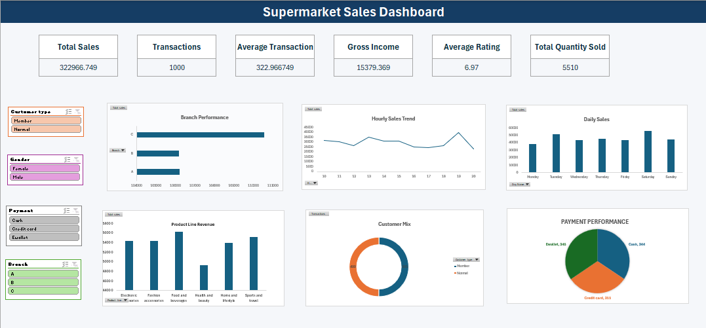

# Supermarket-Sales-Analysis

## Project Overview

This project analyzes supermarket sales data using Microsoft Excel to identify sales trends, customer behavior, product performance, branch performance, and payment preferences.

The project includes data cleaning, exploratory analysis, KPI development, PivotTables, PivotCharts, slicers, and an interactive Excel dashboard.

## Dataset

The dataset contains **1,000 supermarket transactions** across:

* 3 branches
* 3 cities
* 6 product lines
* Multiple customer types
* Multiple payment methods

## Tools Used

* Microsoft Excel
* Power Query
* PivotTables
* PivotCharts
* Slicers
* Excel formulas

## Key KPIs

* Total Sales: ₹322,966.75
* Total Transactions: 1,000
* Average Transaction Value: ₹322.97
* Total Quantity Sold: 5,510
* Total Gross Income: ₹15,379.37
* Average Rating: 6.97
* Highest Transaction: ₹1,042.65

## Analysis Performed

### Branch Analysis

Compared branches based on sales, transactions, quantity sold, gross income, and customer ratings.

### Product Line Analysis

Analyzed sales, transaction volume, quantity sold, average unit price, gross income, and ratings across product lines.

### Customer Analysis

Compared Member and Normal customers using sales, transaction volume, and average transaction value.

### Payment Analysis

Analyzed transaction volume, sales, and average transaction value by payment method.

### Time Analysis

Analyzed sales performance by day of the week and hour of the day.

### Day × Hour Analysis

Examined sales across different combinations of weekdays and transaction hours.

## Dashboard

The interactive dashboard includes:

* KPI cards
* Branch Performance
* Product Line Revenue
* Daily Sales
* Hourly Sales Trend
* Customer Mix
* Payment Preference
* Interactive slicers

## Key Insights

* Branch C generated the highest total sales and gross income.
* Food and beverages recorded the highest sales among product lines.
* Electronic accessories recorded the highest quantity sold.
* Member and Normal customers had similar transaction volumes, while Members generated higher sales.
* Saturday recorded the highest daily sales.
* 7 PM recorded the highest hourly sales in the analysis.
* Cash and Ewallet had very similar transaction volumes, while cash generated higher sales.

## Project Workflow

**Raw CSV → Power Query → Cleaned Data → Analysis → Dashboard → GitHub**

## Files

* `supermarket_sales.csv` — Raw dataset
* `SSupermarket_Sales_Portfolio.xlsx` — Excel analysis and interactive dashboard

## Purpose

This project was created as a practical data analytics portfolio project to demonstrate Excel-based data cleaning, analysis, visualization, and dashboard development.

## Author

**Dhanush**
Data Analytics | Python | Pandas | Power BI | Data Visualization

[GitHub](https://github.com/Dhanush086)

